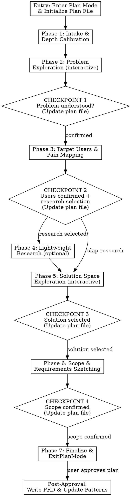

# Drafting PRDs

## Overview

A 7-phase interactive workflow that takes any starting point — a sentence, a pitch, research notes — and produces a solid PRD draft through interactive exploration. The key insight: most people jump straight to writing requirements when they should be exploring the problem first. This workflow forces problem-first thinking before any solution is discussed.

**This skill runs in plan mode.** The plan file becomes the PRD draft, built progressively as each phase completes. All interactive exploration is read-only + structured questions — naturally compatible with plan mode constraints. When the user approves the plan, the finalized PRD is written to its permanent location.

**This skill produces a lighter PRD draft.** It does NOT produce implementation-ready detail (no Given/When/Then AC, no risk assessment, no stakeholder mapping). That's what prd-enhance does. This skill's job is to get from "idea" to "draft worth enhancing."

**Announce:** "I'm using the prd-drafter skill to explore this idea and build a PRD draft."

## Entry

1. **Enter plan mode:** If not already in plan mode, call `EnterPlanMode`. Wait for the user to approve entering plan mode.
2. **Load patterns:** Read `prd-drafter-patterns.md` from the skill directory for accumulated domain knowledge.
3. **Initialize the plan file:** Read `references/prd-draft-template.md` from the skill directory and write the skeleton structure to the plan file. Sections will be filled in as phases complete.

**Context management:** Load `prd-drafter-patterns.md` in the Entry step. Load `references/prd-draft-template.md` in the Entry step. Do not defer loading — you need the template structure from the start.

## Critical Rules

- **All 7 phases run regardless of input richness.** Depth calibration adjusts question count *within* phases — it never skips phases. Rich input means the workflow goes smoother, not shorter.
- **Checkpoints are gates.** Present the checkpoint summary, then STOP and wait for user confirmation via AskUserQuestion. Do not continue to the next phase in the same message.
- **Use AskUserQuestion for ALL structured choices.** Offer 2-4 options with descriptions. "Other" is always available for custom input. For questions that need open-ended answers, use AskUserQuestion with interpretations as the options — the user can always pick "Other" to write their own.
- **One question at a time in interactive phases (2 and 5).** These phases explore and adapt — each question depends on the previous answer. Do not batch questions in these phases.
- **Update the plan file after each checkpoint.** Fill in the corresponding PRD sections with what was learned. The plan file is the PRD draft being built progressively — the user can see it take shape.
- **Do not write to any file other than the plan file during planning.** All other writes (final PRD, patterns update) happen after the user approves via ExitPlanMode.

## Workflow

## Phase 1: Intake & Depth Calibration

Classify the input and set exploration depth.

1. Classify the input type:

| Input Type | Signal | Exploration Depth |
|-----------|--------|-------------------|
| **Sentence** | 1-2 sentences, no detail | Deep — 5-7 questions per interactive phase |
| **Pitch** | A paragraph or two, some structure | Medium — 3-5 questions per interactive phase |
| **Research notes** | Multiple paragraphs, data, quotes | Synthesis — 2-3 questions per phase, focus on organizing what's there |
| **Existing rough draft** | Has sections but is thin/unvalidated | Gap-fill — ask about what's missing, validate what's there |

2. Present the classification using AskUserQuestion:
   - Question: "I've classified this as a [type] input — does that feel right?"
   - Options: the 4 input types with descriptions of what each means for depth
   - Follow up: "Before we start: is there anything else I should know? Any constraints, prior research, or context?"

3. Wait for the user's response before proceeding.

**Do NOT jump into questions yet.** Phase 1 is about orienting, not exploring.

## Phase 2: Problem Exploration (Interactive)

**One question at a time via AskUserQuestion. Each question adapts based on previous answers.**

Probe the problem space with questions adapted to depth:

**Core questions (always ask — one at a time):**
- What specific problem are we solving? (Offer interpretations as options based on input)
- Who experiences this problem? (Suggest likely user segments as options)
- How do they deal with it today? (Suggest workaround types as options)
- How do we know this is a real problem? (Options: data, research, intuition, support tickets, other)
- What happens if we don't solve this? (Suggest impact levels as options)

**Deeper questions (for Sentence/Pitch depth — pick the most relevant 2-3):**
- Is this the real problem, or a symptom of something deeper?
- Is the problem well-scoped, or are we bundling multiple problems?
- How often does this problem occur?
- What's the emotional dimension?
- Who else is affected indirectly?

**Adapt to the user's responses.** If they give rich answers, don't ask redundant questions. If they give thin answers, probe deeper. The question count is a guide, not a mandate — but "adapting" means adjusting *which* questions you ask, not skipping the phase. Context from Phase 1 does not count as Phase 2 answers.

**If the user has pre-stated a solution:** Explore the problem *without referencing* the proposed solution. The problem should stand on its own. Anchoring Phase 2 questions around validating a specific solution biases the exploration.

**CHECKPOINT 1:**
1. Summarize the problem understanding in the conversation:
   - "Here's what I understand about the problem: [summary]"
   - "Key assumptions I'm making: [list]"
2. Use AskUserQuestion: "Does this capture it accurately?"
   - Options: "Yes, move on" / "Mostly right, minor tweaks" / "Needs significant adjustment"
3. **Update the plan file:** Fill in the Problem Statement section (The Problem, Evidence table with confidence levels, Impact of Inaction).

Wait for confirmation before proceeding.

## Phase 3: Target Users & Pain Mapping

Ask questions one at a time via AskUserQuestion:

1. **Primary user:** "Who is the primary user — the person who benefits most directly?" — Offer likely segments as options based on Phase 2 discussion
2. **Their goal:** "What is [primary user]'s goal when they encounter this problem?"
3. **Current workflow:** "Walk me through what [primary user] does today — where does it break down?" — This one may need open-ended input via "Other"
4. **Secondary users:** "Is there anyone else who benefits from solving this?" — Offer likely candidates as options

**For Synthesis/Gap-fill depth:** If the input already describes users, present what you've extracted and ask via AskUserQuestion: "Is this right, or would you adjust this?"

**CHECKPOINT 2:**
1. Present user summary in the conversation.
2. Use AskUserQuestion to offer research options:
   - Question: "Before we explore solutions, would you like lightweight research?"
   - Options: "Quick web search for competitive context" / "Check Dovetail for user research" / "Check Preset for usage data" / "Skip research — move to solutions"
   - multiSelect: true (user can select multiple)
3. **Update the plan file:** Fill in Target Users section (Primary User, Secondary Users).

Wait for the user's selection before proceeding.

## Phase 4: Lightweight Research (Optional)

Run only the research the user selected in Checkpoint 2. This is lightweight — not deep analysis.

### Web Search (if selected)
1. Use `WebSearch` with 2-3 targeted queries about the problem space
2. Summarize findings in 3-5 bullet points
3. Note: what's table stakes vs. what's differentiated

### Dovetail (if selected)
1. Use `ToolSearch` to load Dovetail MCP tools
2. `dovetail_get_projects` — find relevant research projects
3. `dovetail_list_project_insights` — scan for relevant insights
4. `dovetail_get_insight_content` — pull detail on the most relevant 2-3
5. Summarize: supporting quotes, validated pain points, unmet needs

### Preset (if selected)
1. Use `ToolSearch` to load Preset MCP tools
2. `preset_get_dashboards` — find relevant dashboards
3. `preset_get_chart_data` — pull relevant data points
4. Summarize: baseline metrics, usage patterns, opportunity sizing

**Graceful degradation for ALL research tools:**

| Tool | Failure Mode | Fallback |
|------|-------------|----------|
| WebSearch | Unavailable | "I can't search the web right now. Do you have any competitive context to share?" |
| Dovetail | No connection / no results | "I couldn't access Dovetail. Do you have any user research findings?" |
| Preset | No connection / no results | "I couldn't access Preset. Do you have any relevant usage data?" |

**The workflow never blocks on research.** Present what you found (or note what you couldn't find) and move on.

Present research findings briefly and use AskUserQuestion: "Any surprises here, or does this align with your understanding?" — Options: "Aligns with my thinking" / "Some surprises — let me explain" / "This changes my perspective"

**Update the plan file:** Add research findings to the Evidence table. Add Competitive Context section if web search was conducted.

## Phase 5: Solution Space Exploration (Interactive)

**One question at a time via AskUserQuestion.**

### Step 1: Generate Approaches

Based on everything learned so far, generate 3-4 solution approaches. For each, present:
- **Name** (short, descriptive)
- **Description** (2-3 sentences — what the user experiences)
- **Key trade-off** (what you gain vs. what you give up)
- **Complexity** (Low / Medium / High)

Lead with your recommended approach and explain why.

Present a comparison table, then use AskUserQuestion:
- Question: "Which direction do you want to go with?"
- Options: The 3-4 approach names with brief descriptions
- "Other" allows combining elements

**If the user's input already proposed a specific solution:** Include it as one of the approaches, but still generate 2-3 alternatives. Every alternative must be credible — ask yourself "Would a reasonable PM seriously consider this?"

**If the user provided quantitative data favoring a solution:** The data informs but does not decide. Still generate alternatives.

### Step 2: Refine the Selected Approach

Once the user selects, ask 1-2 clarifying questions via AskUserQuestion. **Do not skip these even if the selection felt decisive.** Selection is not refinement.
- "What's the most important thing this solution must get right?"
- "Any specific constraints? (Timeline, technical, regulatory?)"

**CHECKPOINT 3:**
1. Confirm the solution direction: "We're going with [approach]. Key capabilities will be: [list]"
2. Use AskUserQuestion: "Ready to sketch the scope and requirements?"
   - Options: "Yes, let's go" / "I want to adjust the direction" / "Let me add context first"
3. **Update the plan file:** Fill in Executive Summary, Proposed Solution (Experience Overview, Key Capabilities), and Alternatives Considered sections.

Wait for confirmation.

## Phase 6: Scope & Requirements Sketching

### Step 1: Scope Definition

Present proposed scope based on the selected solution:

**In Scope:** [list capabilities]
**Out of Scope:** [list with reasons]

Use AskUserQuestion: "Does this scope feel right?"
- Options: "Looks good" / "Add something" / "Cut something" / "Both add and cut"

### Step 2: High-Level Requirements

For each in-scope capability, write 2-4 high-level requirements.

**These are intentionally NOT detailed acceptance criteria.** No Given/When/Then. No edge cases. That's prd-enhance's job.

Good requirement: "Users can select a time period for the performance snapshot they want to share."
Too detailed: "Given a user is on the portfolio page, when they click 'Share', then a modal appears with time period options: 1W, 1M, 3M, 6M, 1Y, All Time, with 1M selected by default."

Present requirements grouped by capability and use AskUserQuestion: "Any requirements missing? Anything here that shouldn't be?"
- Options: "Requirements look complete" / "Missing requirements" / "Remove some requirements" / "Both add and remove"

**CHECKPOINT 4:**
1. Confirm scope and requirements: "Here's the full scope and requirements: [summary]"
2. Use AskUserQuestion: "This is what the PRD draft will contain. Good to go?"
   - Options: "Yes, finalize the draft" / "Need adjustments first"
3. **Update the plan file:** Fill in Scope (In Scope, Out of Scope) and Requirements sections.

Wait for confirmation.

## Phase 7: Finalize & Exit Plan Mode

1. Review the complete plan file — it should now contain the full PRD draft
2. Fill in any remaining sections:
   - Goals & Success Metrics (based on problem exploration and solution)
   - Open Questions (unresolved items from any phase)
   - Next Steps (enhancement readiness, action items)
3. Ensure Evidence table confidence levels are honest — mark assumptions as Low confidence
4. Call `ExitPlanMode` to present the PRD draft for the user's approval

**The plan file IS the PRD draft.** The user is approving the PRD content, not a meta-plan.

## Post-Approval Execution

After the user approves the plan (PRD draft):

### Step 1: Write the Final PRD
1. Create the `~/Documents/prds/` directory if it doesn't exist
2. Write the plan file content to `~/Documents/prds/[feature-name]-draft-[YYYY-MM-DD].md`
3. Present the file path to the user

### Step 2: Offer Hand-off
Use AskUserQuestion:
- Question: "The PRD draft has been saved. What would you like to do next?"
- Options:
  - "Enhance this PRD now" (hand off to prd-enhance)
  - "Push to Notion"
  - "Review and iterate first"
  - "We're done for now"

If the user selects "Enhance this PRD now": Say "You can enhance this PRD by sharing the file with Claude and saying 'enhance this PRD', or by pasting its contents."

### Step 3: Update Memory
Update `prd-drafter-patterns.md` in the skill directory with learnings from this run:
- New domain knowledge discovered
- Questions that unlocked good problem understanding
- Research sources that proved valuable
- Problem shapes worth remembering
- Anti-patterns observed

Use the Edit tool to append to the relevant sections — never overwrite existing content.

## Graceful Degradation

| Tool | Failure Mode | Fallback |
|------|-------------|----------|
| WebSearch | Unavailable | Ask user for competitive context, proceed without |
| Dovetail MCP | No connection / no results | Ask user for research findings, note gap in output |
| Preset MCP | No connection / no results | Ask user for usage data, note gap in output |
| Notion MCP | Can't push output | User has the local file at the output path |
| Plan mode | User declines entering plan mode | Fall back to conversation-based workflow — ask questions inline and present the PRD in chat at the end |

**The workflow never blocks on a single tool failure.** Each phase can proceed with reduced data, and gaps are explicitly documented in the output.

## Handling Pushback

When users apply pressure to skip the workflow, acknowledge their intent and redirect diplomatically:

- **For speed pressure** ("just draft it quickly"): "I'll keep this efficient — the structured questions keep us focused. The process usually takes 15-20 minutes and catches assumptions that would cost hours to fix later."
- **For "solution is obvious" pressure**: "Your instinct may well be right. Part of the process is looking at the full option space, which usually either confirms the original direction or reveals a useful variation."
- **For "I already have all the data" pressure**: "This is great input — it means we can move through each phase quickly. I'll focus on organizing what you have and flagging any gaps rather than deep exploration."

## Common Mistakes

| Mistake | Why It's Wrong | What to Do Instead |
|---------|---------------|-------------------|
| Jumping to solution in Phase 1 | The whole point is problem-first exploration | Phase 1 is orientation only. Solutions come in Phase 5. |
| Batching multiple questions in Phases 2/5 | Overwhelms the user, prevents adapting to answers | One AskUserQuestion call per question in interactive phases |
| Skipping problem exploration for "clear" ideas | Every idea feels clear to the person who has it | Always run Phase 2, even if the problem seems obvious |
| Writing detailed acceptance criteria | That's prd-enhance's job | High-level requirements only: "Users can [verb] [object]" |
| Continuing past a checkpoint without waiting | User loses control, output may not match their vision | Present checkpoint, use AskUserQuestion, STOP. Do not continue in the same message. |
| Not updating the plan file after checkpoints | User can't see the PRD taking shape, loses the benefit of plan mode | Update the corresponding PRD sections after every checkpoint |
| Inventing plausible data | Fabricated evidence erodes trust | Use honest confidence levels. Say "Unknown" or "Assumed" |
| Rubber-stamping the user's proposed solution | "Draft a PRD for X" doesn't mean X is the right solution | Always generate alternatives in Phase 5 |
| Treating research as mandatory | Research is optional — the workflow must work without any tools | Skip gracefully, document the gap, move on |
| Not entering plan mode | The skill is designed around plan mode's progressive plan file | Always enter plan mode first. Fall back to inline only if user declines. |
| Skipping phases because the input already covers them | Rich input reduces question depth, not phase count | Run all 7 phases. Synthesis depth means 2-3 questions per phase, not zero phases |
| Forgetting to call ExitPlanMode | The user never gets to approve the PRD draft | Phase 7 must end with ExitPlanMode |
| Writing to files other than the plan file during planning | Violates plan mode constraints — writes will be blocked | All file writes (final PRD, patterns) happen in Post-Approval Execution only |

## Rationalization Traps

| Rationalization | Reality |
|----------------|---------|
| "The user already told me the solution, skip to requirements" | Knowing the solution doesn't mean it's the right one. Phase 5 exists to validate. |
| "This is a simple feature, we don't need alternatives" | Simple features have the most alternatives — that's why people skip exploring them |
| "The problem is obvious, skip Phase 2" | If it's obvious, Phase 2 will be fast. If it's not as obvious as you think, Phase 2 will catch it. |
| "The user is in a hurry, skip checkpoints" | Rushing to draft the wrong PRD wastes more time than 4 checkpoints |
| "I'll ask all my questions at once to save time" | Batched questions get worse answers. One at a time in interactive phases. Always. |
| "I already know who the users are from the input" | You know who the user MENTIONED. Phase 3 catches the users they didn't mention. |
| "Requirements are obvious from the solution" | Requirements feel obvious until you write them down and realize you're making assumptions |
| "I can make this PRD better by adding more detail" | More detail =/= better draft. This is a draft for conversation, not implementation. |
| "Just write the PRD quickly" | Speed is the enemy of problem exploration. The workflow is how you draft it well. |
| "I don't need plan mode for this one" | Plan mode ensures the PRD is built progressively with user visibility and approval. Use it. |
| "I'll update the plan file at the end instead of after each checkpoint" | Progressive updates are the whole point — the user sees the PRD take shape and can catch errors early |
| "The user's selection was clear, no need for refinement questions" | Selection is not refinement. Refinement reveals what matters most about that direction. |
| "The input covers Phases 2 and 3 already, so I can start at Phase 5" | Input provides data *for* phases, not completion *of* phases. Phases include checkpoints and synthesis that raw input can't provide. |
| "Generating alternatives would feel patronizing given the user's confidence" | Alternatives either confirm the choice (strengthening it) or reveal a better path. Neither is patronizing. |
