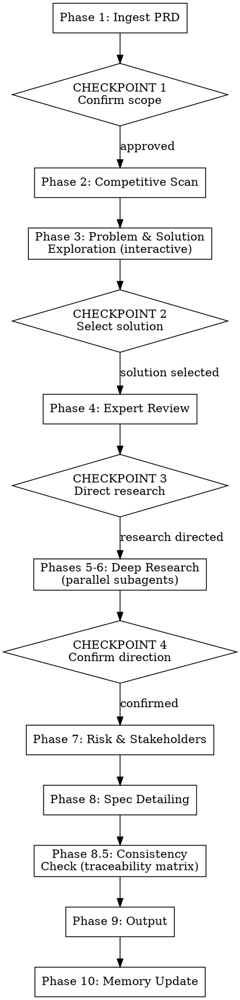

# Enhancing PRDs

## Overview

A 10-phase workflow that takes a PRD from initial draft to implementation-ready document. The key insight: most PRDs jump to a solution without validating the problem or exploring alternatives. This workflow challenges the problem first, explores the solution space interactively, then enhances the chosen direction with data, expert review, and spec detail.

**Announce:** "I'm using the prd-enhance skill to systematically strengthen this PRD."

**Context management:** Do NOT load all reference files upfront. Load each reference file only in the phase that needs it:
- `prd-patterns.md` — load in Phase 1 (Ingest)
- `references/expert-review-checklist.md` — load in Phase 4 (Expert Review)
- `references/preset-query-patterns.md` — load in Phase 6 (Data Enhancement)
- `references/prd-output-template.md` — load in Phase 9 (Output)

Loading files early wastes context window and may cause you to skip reading them when actually needed.

## Workflow



## Phase 1: Ingest

Read the PRD from its source and extract key metadata.

**Source detection:**
- **Notion:** Use `ToolSearch` to load Notion tools, then `notion-fetch` with the page URL
- **Linear:** Use `ToolSearch` to load Linear tools, then `get_issue` or `get_project`
- **Local file:** Use `Read` tool
- **Pasted content:** Work directly with the provided text

**Then:**
1. Read `prd-patterns.md` from the skill directory for accumulated domain knowledge
2. Extract metadata: feature name, target users, problem statement, proposed solution, success metrics
3. Identify what's present vs. missing (use the expert checklist categories as a gap scan)

**CHECKPOINT 1:** Present a summary to the user:
- "Here's what I extracted from the PRD: [summary]"
- "Key gaps I've identified: [gaps]"
- "Shall I proceed with the full enhancement workflow, or focus on specific areas?"

Wait for user confirmation before proceeding.

## Phase 2: Quick Competitive Scan

Lightweight research to understand the market context. This informs the brainstorming in Phase 3.

1. Use `WebSearch` with 2-3 targeted queries about the problem space
2. Identify 3-5 competitors or products addressing similar problems
3. Summarize each competitor's approach in 1-2 sentences
4. Note any patterns: what's table stakes vs. differentiating

Present findings briefly — deep competitive analysis is not the goal here. The goal is to inform the brainstorming with awareness of what exists.

**Graceful degradation:** If WebSearch is unavailable, ask the user: "I can't search the web right now. Can you share any competitive context, or should I proceed without it?"

## Phase 3: Problem & Solution Exploration

**This phase is highly interactive.** Follow the brainstorming skill pattern: one question at a time, multiple choice options preferred, responses of ~200-300 words.

### Sub-phase 3a: Challenge the Problem

Ask questions ONE AT A TIME to probe the problem statement:

- Is this the real problem, or a symptom of something deeper?
- Is the problem well-scoped, or are we bundling multiple problems?
- Who experiences this problem most acutely?
- How do we know this is a real problem? (data, research, intuition, support tickets?)
- What happens if we don't solve this?

**Format each question as multiple choice when possible:**
```
The PRD states the problem is [X]. Which of these best describes the root issue?

A) [X] is indeed the core problem — users directly experience [pain]
B) [X] is a symptom — the real problem is [deeper issue]
C) [X] is too broad — we should narrow to [specific aspect]
D) I'm not sure — let's explore further
```

### Sub-phase 3b: Clarify Goals

One question at a time:
- What does success look like in 6 months?
- What are the constraints (timeline, technical, regulatory)?
- Who benefits most, and who might be negatively impacted?

### Sub-phase 3c: Brainstorm Solutions

Generate 3-5 approaches (including the one proposed in the PRD), informed by the competitive scan:

Present each approach with:
- Brief description (2-3 sentences)
- Key trade-offs (pros/cons)
- How it compares to competitive approaches
- Estimated complexity (Low/Medium/High)

Lead with your recommended approach and explain why.

### Sub-phase 3d: Evaluate and Select

Help the user compare solutions and commit to one direction:
- Present a comparison table
- Highlight key differentiators
- Ask: "Which direction do you want to go with?"

**CHECKPOINT 2:** User selects the solution direction to enhance. This is the direction that the rest of the workflow will deepen and detail.

## Phase 4: Expert Review

Load `references/expert-review-checklist.md` from the skill directory using the Read tool.

Review the selected solution from 3 perspectives. For each perspective:
1. List 2-3 **strengths** of the current PRD
2. List 2-3 **gaps** that need addressing
3. List 1-2 **critical questions** that must be answered
4. Provide 1-2 **recommendations**

### Product Leader Perspective
Focus on: problem validation, market fit, success metrics, scope

### Engineering Leader Perspective
Focus on: feasibility, architecture impact, edge cases, operational readiness

### Design Leader Perspective
Focus on: user journey, interaction states, accessibility, design system fit

### Incorporate Feedback

Before moving to research, address the expert review findings:

1. **Critical questions:** Present the critical questions from all three perspectives to the user. These must be answered before proceeding — they often reshape scope, metrics, or requirements. Present questions one at a time (following the interactive pattern from Phase 3).
2. **Gaps:** Compile the identified gaps into a running list. These become explicit items to address in Phases 7-8 (risk assessment, spec detailing). Track them — don't let them drop.
3. **Recommendations:** Note which recommendations the user wants to adopt. Update the working direction accordingly.

Ask the user: "Here are the critical questions from the expert reviews. Let's address these before diving into research — they may change what we need to research."

**CHECKPOINT 3:** Present the reviews and ask the user which research phases to run:
- "Based on these reviews, I can research the following. Which should I pursue?"
  - Client insights from Dovetail (user research validation)
  - Data analysis from Preset (usage metrics, opportunity sizing)
  - Both
  - Neither — skip to risk assessment

## Phase 5: Client Insights (Dovetail Research)

Use `ToolSearch` to load Dovetail MCP tools, then:

1. `dovetail_get_projects` — find research projects relevant to the feature area
2. `dovetail_list_project_insights` — scan for relevant insights
3. `dovetail_get_insight_content` — pull detail on the most relevant insights
4. `dovetail_list_project_data` / `dovetail_get_data_content` — find supporting quotes and pain points

**What to look for:**
- User quotes that validate (or contradict) the problem statement
- Pain points that map to the proposed solution
- Unmet needs that the PRD hasn't addressed
- Segments that care most about this problem

**Graceful degradation:** If Dovetail MCP is unavailable or returns no results:
- Ask the user: "I couldn't access Dovetail. Do you have any user research findings to share?"
- Proceed without client insights — note the gap in the output

## Phase 6: Data Enhancement (Preset Analytics)

Use `ToolSearch` to load Preset MCP tools, then:

1. `preset_get_dashboards` — find dashboards relevant to the feature area
2. `preset_get_chart_data` — pull data from relevant existing charts
3. Load `references/preset-query-patterns.md` for SQL templates
4. `preset_query` — run custom queries for data gaps (adapt patterns from reference file)

**What to look for:**
- Current baseline metrics (usage, adoption, error rates)
- Opportunity sizing (affected users, revenue impact)
- Funnel data (where users drop off)
- Segment analysis (who uses this feature area most)

**Graceful degradation:** If Preset MCP is unavailable:
- Ask the user: "I couldn't access Preset. Do you have any analytics data to share?"
- Suggest specific metrics the PRD should include, even without current data
- Proceed — note the gap in the output

**CHECKPOINT 4:** Present consolidated research findings:
- Key client insights with supporting quotes
- Key data points with charts/tables
- "Does this align with your understanding? Should we adjust the direction before continuing?"

## Phase 7: Risk Assessment & Stakeholder Mapping

### Risk Assessment

Evaluate risks across three categories. For each risk, assess likelihood (H/M/L), impact (H/M/L), and propose a mitigation.

**Technical risks:** feasibility, performance, security, data model changes, dependencies on other teams
**Product risks:** adoption, market timing, cannibalization of existing features, competitive response
**Execution risks:** resourcing, timeline, dependencies, knowledge gaps

**Assumptions requiring validation:** List every assumption the PRD makes that, if wrong, would change the approach. For each, propose a validation method.

### Stakeholder Mapping

Use the RACI-like model:
- **Approvers:** Who must approve before development starts?
- **Consulted:** Who should be consulted during design/development?
- **Informed:** Who needs to know about the change?
- **Impacted:** Who is affected but has no decision-making authority?

Ask the user to fill in names/teams if you can't determine them from context.

## Phase 8: Spec Detailing

Ensure every requirement is implementation-ready.

**For each requirement:**
1. Write testable acceptance criteria using Given/When/Then format
2. Document edge cases and expected behavior
3. Define error states and fallback behavior

**For complex flows:**
- Document state transitions
- Define API contracts (endpoints, request/response shapes, error codes) if applicable
- Note dependencies between requirements

**Quality test:** Ask yourself: "Could a developer implement this requirement without asking a single clarifying question?" If not, add detail until the answer is yes.

**Prioritization & dependencies:**
1. Assign each requirement a priority: P1 (must-have for MVP), P2 (important, not launch-blocking), P3 (nice-to-have)
2. Identify dependencies between requirements (which requirements must be built first?)
3. Verify that P1 requirements alone form a viable, shippable increment

**Scope check:** Before moving to the consistency check, ask: "Is the proposed scope proportional to the validated problem? Could we achieve 80% of the value with fewer requirements?" If the answer is yes, flag over-specified requirements for the user to review.

### Requirement Review

Walk through each requirement one at a time with the user. For each requirement, present:
- The requirement statement
- Its acceptance criteria
- Edge cases and error states
- Its priority (P1/P2/P3)

Ask: "Here's requirement [N]. Does this look right, or would you like to change anything — the scope, acceptance criteria, priority, or edge cases?"

Wait for the user's response before presenting the next requirement. Incorporate edits immediately.

This is where requirements get real scrutiny. The user knows their domain better than the skill does — give them the chance to catch what's wrong before it's locked in.

## Phase 8.5: Consistency Check

Verify the chain: problem → goals → metrics → requirements → acceptance criteria.

**Build a traceability matrix:**

| Problem | Goal | Metric | Requirement(s) | AC Coverage |
|---------|------|--------|----------------|-------------|
| [Each problem from Phase 3] | [Goal it maps to] | [Metric that measures it] | [Req(s) that address it] | [Yes/Partial/No] |

**Check for breaks in the chain:**
1. **Orphaned requirements:** Any requirement that doesn't trace back to a stated problem or goal? Flag it — it may be scope creep.
2. **Unmeasured goals:** Any goal without a metric? Add one or question whether the goal is real.
3. **Untested requirements:** Any requirement without acceptance criteria that actually test it (not adjacent functionality)? Fix it.
4. **Phantom problems:** Any problem from Phase 3 that no requirement addresses? Either add a requirement or document why it's deferred.

Present the matrix to the user: "Here's the traceability between your problems, goals, metrics, and requirements. Any gaps are flagged."

## Phase 9: Output

1. Load `references/prd-output-template.md` from the skill directory using the Read tool
2. Assemble the enhanced PRD using the template, filling in all sections from the work done in Phases 1-8
3. Save to `~/Documents/prds/[feature-name]-enhanced-[YYYY-MM-DD].md`
4. Create the `~/Documents/prds/` directory if it doesn't exist

**Then ask:**
- "The enhanced PRD has been saved to [path]. Would you like me to push it back to the source?"
  - If Notion: offer to update the original page via `notion-update-page`
  - If Linear: offer to update the issue/project description
  - If neither: skip

## Phase 10: Memory Update

Update `prd-patterns.md` in the skill directory with learnings from this run:
- New domain knowledge discovered
- Gaps that were common or surprising
- Data sources that proved valuable
- Review questions that surfaced important insights
- Solution patterns worth remembering

Use the Edit tool to append to the relevant sections — never overwrite existing content.

## Graceful Degradation

| Tool | Failure Mode | Fallback |
|------|-------------|----------|
| Notion MCP | Can't fetch PRD | Ask user to paste content or provide file path |
| Linear MCP | Can't fetch issue | Ask user to paste content or provide file path |
| WebSearch | Search unavailable | Ask user for competitive context, proceed without |
| Dovetail MCP | No connection / no results | Ask user for research findings, note gap in output |
| Preset MCP | No connection / no results | Suggest metrics to include, note gap in output |
| Notion update | Can't push back | User has the local file at the output path |

**The workflow never blocks on a single tool failure.** Each phase can proceed with reduced data, and gaps are explicitly documented in the output.

## Common Mistakes

| Mistake | Why It's Wrong | What to Do Instead |
|---------|---------------|-------------------|
| Skipping Phase 3 exploration | Enhancing a bad solution produces a well-documented bad solution | Always challenge the problem and explore alternatives first |
| Batching multiple questions | Overwhelms the user, reduces quality of answers | One question per message, multiple choice preferred |
| Treating competitive scan as deep analysis | Phase 2 is lightweight context-setting, not a market report | 3-5 competitors, 1-2 sentences each |
| Skipping checkpoints | User loses control, output may not match expectations | Always pause and confirm at each checkpoint |
| Writing vague acceptance criteria | "User can do X" is not testable | Use Given/When/Then with specific conditions |
| Ignoring graceful degradation | Workflow blocks when a tool is unavailable | Follow the fallback table above |
| Not updating prd-patterns.md | Institutional memory is lost | Always update at the end, even if learnings seem minor |
| Over-writing prd-patterns.md | Existing knowledge is destroyed | Append with Edit tool, never overwrite |
| Presenting all expert reviews at once | Too much to process | Present each perspective separately, let user absorb |
| Skipping Phase 7 risks | PRD looks complete but has hidden assumptions | Every PRD has risks — surface them explicitly |
| Inventing plausible data | Fabricated metrics erode trust and lead to bad decisions | Say "Would query [source] for [question]" or ask the user for data |
| Presenting expert feedback without incorporating it | Gaps and questions are surfaced but never addressed — the review becomes performative | Address critical questions before Checkpoint 3. Track gaps as items for Phases 7-8. |
| Loading all reference files in Phase 1 | Wastes context window, may not re-read when actually needed | Load each file only in its designated phase |
| Skipping requirement prioritization | All requirements look equal, so MVP is unclear and scope creeps | Assign P1/P2/P3 to every requirement. P1s alone must ship. |
| Skipping the consistency check | Problems, goals, metrics, and requirements drift apart silently | Build the traceability matrix. Flag orphans. |
| Over-specifying scope | More requirements =/= better PRD — it means more to build and more to go wrong | Ask "Could we get 80% of the value with fewer requirements?" |
| Presenting all requirements at once for review | Wall of text — user skims instead of scrutinizing, weak requirements slip through | Present one requirement at a time, wait for feedback before moving on |

## Rationalization Traps

| Rationalization | Reality |
|----------------|---------|
| "The PRD already has a clear solution, skip Phase 3" | Phase 3 is where we validate the solution is the RIGHT one |
| "Competitive scan isn't needed for internal tools" | Even internal tools have alternatives (manual processes, other tools) |
| "The user seems in a hurry, skip the exploration" | Rushing to enhance the wrong solution wastes more time |
| "Dovetail had no results so research is done" | Ask the user for research findings — absence of data in a tool doesn't mean absence of research |
| "Risk assessment is obvious, skip it" | Obvious risks are still worth documenting. Non-obvious ones are why we do this. |
| "The PRD is already pretty detailed" | Detailed is not the same as validated, evidence-backed, or implementation-ready |
| "I'll load all reference files now to save time" | Loading files early wastes context. Load each file in its phase. |
| "I can invent plausible data points to fill gaps" | Never fabricate data. Use "Would query [source] for [question]" or ask the user. Invented data erodes trust. |
| "Every requirement is P1, they're all important" | If everything is P1, nothing is. Force-rank. A viable MVP requires hard prioritization choices. |
| "The consistency check is just overhead" | Orphaned requirements are how scope creep hides. The matrix catches drift between problem and solution. |
| "We need all these requirements to ship" | Ask "what's the simplest version that solves the core problem?" More scope = more risk. |
| "The expert review is just context for research" | No — the critical questions often reshape scope and direction. Skipping them means researching the wrong thing. |
| "The user already approved the direction in Checkpoint 2, individual review is redundant" | Approving a direction is not approving every requirement's details. Acceptance criteria and edge cases need their own scrutiny. |
