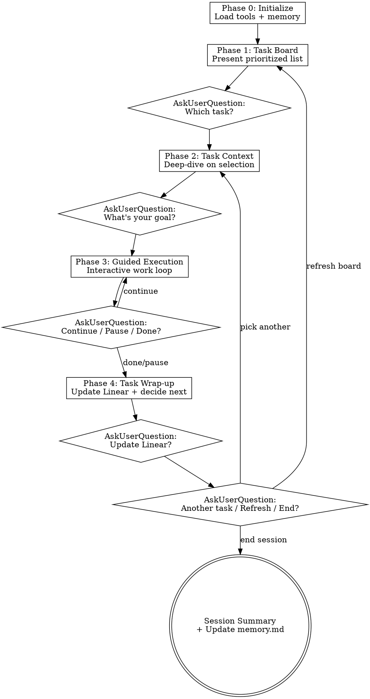

# Task Crusher

A long-running interactive skill that loads your highest-priority Linear tasks, lets you pick one, helps you execute on it through guided interactions, and loops back to the board when you're done. Primary work types: research and writing.

**Announce:** "Using **task-crusher** to work through your Linear tasks."

Run this skill exactly as written. Do not skip phases or reorder them.

## Critical Rules

1. **STOP and WAIT** after every `AskUserQuestion`. Do NOT continue in the same message. The user drives the pace.
2. **Never update Linear without asking.** Every status change, comment, or edit goes through `AskUserQuestion` first.
3. **Board first, then deep-dive.** Don't dump full task details until the user selects a task.
4. **Let the user choose.** Never auto-select the top priority. Present options, let them pick.
5. **Load tools before calling them.** `ToolSearch "+linear"` before any Linear API calls.

## Quick Reference: Linear Tool Calls

| Action | Tool | Key Params |
|--------|------|-----------|
| Load tools | `ToolSearch` | `"+linear"` |
| Get my tasks | `list_issues` | `assignee: "me"`, `team: "Product Managers"` |
| Get statuses | `list_issue_statuses` | `team: "Product Managers"` |
| Task details | `get_issue` | `id`, `includeRelations: true` |
| Comments | `list_comments` | `issueId` |
| Update task | `update_issue` | `id`, status/priority/etc. |
| Add comment | `create_comment` | `issueId`, `body` |

## Main Loop



## Phase 0: Initialize

1. **Load Linear tools:**
   ```
   ToolSearch: "+linear"
   ```

2. **Read memory** for cross-session context. If the memory file at `~/.claude/memory/prod-mgr-toolkit/task-crusher.md` does not exist, create it by copying the template from `memory.md` in this skill's directory. Then read the memory file.

3. **Fetch tasks and statuses in parallel:**
   - `list_issues(assignee: "me", team: "Product Managers")`
   - `list_issue_statuses(team: "Product Managers")`

4. **Filter and sort:**
   - Remove terminal states (Done, Cancelled, Duplicate) and In Review
   - Sort by priority: Urgent > High > Normal > Low > No priority
   - Within same priority, sort by due date (soonest first)

## Phase 1: Task Board

Present a clean, scannable task board:

```
Your active tasks (X total):

| # | ID    | Title                        | Priority | Status      | Due        |
|---|-------|------------------------------|----------|-------------|------------|
| 1 | PM-XX | [title]                      | Urgent   | In Progress | Feb 14     |
| 2 | PM-YY | [title]                      | High     | Todo        | Feb 18     |
| ...                                                                            |
```

If memory.md has notes on any visible tasks, add a brief annotation (e.g., "waiting on feedback from Jackie").

**AskUserQuestion:**
- Question: "Which task do you want to work on?"
- Options: Top 3-4 tasks by priority (format: "PM-XX: [short title]")
- User can always pick "Other" to name a different task

**STOP. Wait for user input.**

## Phase 2: Task Context

After the user picks a task:

1. **Fetch full details in parallel:**
   - `get_issue(id, includeRelations: true)`
   - `list_comments(issueId)`

2. **Present a structured summary:**
   - **Description** (full text)
   - **Labels** and **priority**
   - **Relations** (blocks, blocked by, related to)
   - **Recent comments** (last 3-5, with author and date)
   - **Memory notes** (if any exist from previous sessions)

3. **AskUserQuestion:**
   - Question: "What do you want to do with this task?"
   - Options:
     - "Research — dig into a topic, gather info"
     - "Write — draft a document, spec, or response"
     - "Review — analyze existing work or give feedback"
     - "Plan approach — break this down into steps"

**STOP. Wait for user input.**

## Phase 3: Guided Execution

This is the core interactive work loop. The pattern is: **ask > work > present > checkpoint**. Adapt to the open-ended nature of each task.

### Path-Specific First Question

Based on the user's goal selection, start with a targeted `AskUserQuestion`:

**Research:**
- Question: "What specific questions need answering? I can search the web, check internal docs, or help you think through a framework."
- Options: "I have specific questions" / "Help me figure out what to research" / "Start with a web search on [topic from task]"

**Writing:**
- Question: "What format and who's the audience?"
- Options: "Internal doc for the team" / "Stakeholder-facing document" / "Slack message or update" / "Let me describe it"

**Review:**
- Question: "What aspects should I focus on?"
- Options: "Completeness — are there gaps?" / "Clarity — is it easy to follow?" / "Feasibility — can we actually build this?" / "General feedback"

**Planning:**
- Propose a breakdown based on the task description, then ask:
- Question: "Here's a suggested breakdown. Does this look right?"
- Options: "Looks good, let's refine" / "Missing key pieces" / "Start over with a different approach"

**STOP. Wait for user input.**

### Work Loop

After the first question is answered:

1. **Do the work** — research, draft, analyze, or plan based on the user's direction. Use available tools:
   - `WebSearch` for external research
   - `WebFetch` for specific URLs
   - `Read` / `Grep` / `Glob` for local files
   - Linear tools for related tasks or docs
   - Your own reasoning for analysis and writing

2. **Present results** — show what you produced. Keep it structured and scannable.

3. **AskUserQuestion checkpoint:**
   - Question: "How do you want to proceed?"
   - Options:
     - "Continue working on this task" — loop back to more work
     - "Pause this task and switch to another" — go to Phase 4 (no status change)
     - "This task is done" — go to Phase 4 (with completion flow)

**STOP. Wait for user input.**

Repeat the work loop as many times as needed. Each iteration: ask a clarifying question if needed, do work, present, checkpoint.

## Phase 4: Task Wrap-up

### Linear Updates

**AskUserQuestion (multiSelect: true):**
- Question: "How should I update this task in Linear?"
- Options:
  - "Mark as Done"
  - "Move to In Review"
  - "Add a comment summarizing the work"
  - "Change to a different status"
  - "No changes to Linear"

Execute whatever the user selects. If "Change to a different status" is chosen, follow up with another `AskUserQuestion` listing available statuses.

If "Add a comment" is selected, draft a comment based on the work done in Phase 3 and present it for approval before posting.

### Next Action

**AskUserQuestion:**
- Question: "What's next?"
- Options:
  - "Pick another task" — go to Phase 2 (skip board, user already saw it)
  - "Refresh the board" — go to Phase 1 (re-fetch and display)
  - "End session"

**STOP. Wait for user input.**

### On Session End

1. **Present a brief session summary:**
   - Tasks worked on and outcomes
   - Linear updates made
   - Any pending items or notes

2. **Update `~/.claude/memory/prod-mgr-toolkit/task-crusher.md`:**
   - Add session to Recent Sessions (keep last 5, prune oldest)
   - Update Task-Specific Notes for tasks worked on
   - Update Work Preferences if new patterns emerged
   - Update Execution Patterns if new patterns observed

## Graceful Degradation

| Tool Failure | Fallback |
|---|---|
| `list_issues` fails | Ask user to name a task manually, proceed to Phase 2 |
| `get_issue` fails | Use `list_issues` data (title, priority, status), continue without full description |
| `update_issue` fails | Tell user the update failed, suggest they update manually |
| `create_comment` fails | Show the drafted comment text so user can paste it manually |
| `WebSearch` unavailable | Note the limitation, proceed with available tools and reasoning |
| Memory file missing | Start fresh — create the memory file at session end |

## Common Mistakes

| Mistake | Correct Behavior |
|---|---|
| Continuing after `AskUserQuestion` | **STOP.** Wait for user input. Every single time. |
| Updating Linear without asking | Always confirm via `AskUserQuestion` first |
| Dumping all task details on the board | Board shows only: ID, title, priority, status, due date. Details come in Phase 2. |
| Auto-selecting the top priority task | Present the board, let the user choose |
| Not loading tools first | `ToolSearch "+linear"` before any Linear API calls |
| Skipping the checkpoint in Phase 3 | Every work iteration ends with the continue/pause/done checkpoint |
| Skipping memory update on session end | Always update memory.md when ending a session |
| Presenting work without structure | Use headers, bullet points, and clear formatting |
| Asking too many questions at once | One `AskUserQuestion` per gate. Keep it focused. |
